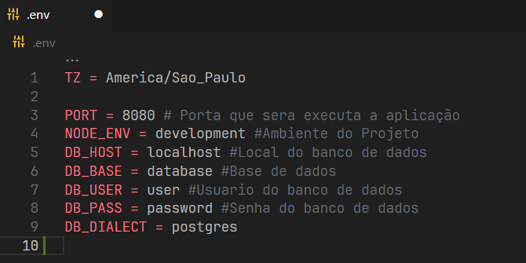
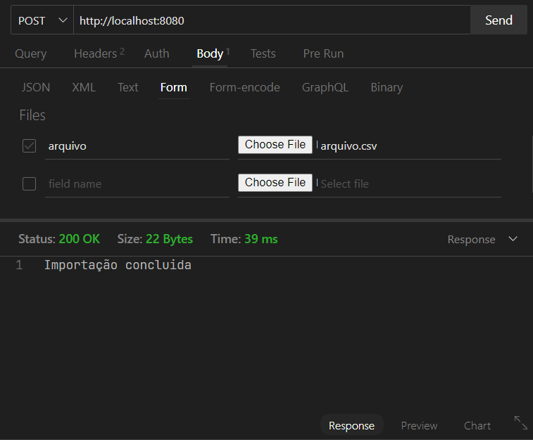

# CSV Reader

## Descrição do Projeto

O projeto CSV Reader é uma aplicação que permite a leitura de arquivos CSV e a inserção dos dados em um banco de dados. Ele foi desenvolvido com o objetivo de facilitar a importação de dados contidos em arquivos CSV para uma base de dados, automatizando esse processo e tornando-o mais eficiente.

## Tutorial de Instalação e Uso

### Requisitos

- Node.js (versão 20 ou superior)
- npm (gerenciador de pacotes do Node.js)
- PostgreSQL

### Instalação

1. Clone o repositório do projeto para o seu ambiente local:

```bash
git clone https://github.com/MateuzCabral/CsvReader.git
```
2. Acesse o diretório do projeto:

```bash
cd CsvReader
```
3. Instale as dependências do projeto utilizando npm:

```bash
npm install
```

### Configuração

1. Certifique-se de ter um banco de dados configurado e acessível. Você precisará das credenciais de acesso para configurar a conexão com o banco de dados.

2. Configure as variáveis de ambiente. O projeto utiliza variáveis de ambiente para armazenar informações sensíveis, como as credenciais de acesso ao banco de dados. preencha as variaveis de acordo com as configurações do seu ambiente no arquivo **.env**




### Utilizando Sequelize CLI
O Sequelize CLI é uma ferramenta de linha de comando que facilita a criação de models e migrations para o Sequelize, um ORM (Object-Relational Mapping) para Node.js.

#### Criando Models
Para criar um novo model, utilize o comando sequelize model:create, seguido do nome do model e dos atributos:

```bash
npx sequelize-cli model:generate --name nomedatabela --attributes id:int,name:string
```
Isso criará um novo arquivo de model na pasta models.

**ATENÇÃO : Crie sua model de acordo com o cabeçalho do arquivo csv**

### Criando Migrations
As migrations são responsáveis por definir e modificar a estrutura do banco de dados. Para executar a migration, utilize o comando sequelize:

```bash
npx sequelize-cli db:migrate
```
Isso criará sua tabela no banco de dados.

### Uso

1. Logo após preencher e criar sua tabela,chegou a hora de importar os dados do arquivo csv,utilize o comando **npm start** para executar a aplicação

2. Após iniciar o servidor, você poderá enviar arquivos CSV para a rota / utilizando qualquer cliente HTTP (por exemplo, Postman, cURL,Insomnia,ThunderClient).

3. Envie uma requisição POST para a rota /, incluindo o arquivo CSV como parte do corpo da requisição. Certifique-se de que o nome do campo que contém o nome do arquivo seja arquivo.



**Exemplo de post em cURL :**

```bash
curl -X POST \
  http://localhost:8080/ \
  -F arquivo=@caminho/do/seu/arquivo.csv
```

4. O servidor irá processar o arquivo CSV, ler seus dados e inseri-los no banco de dados. Você receberá uma resposta indicando o status da importação se houve Sucesso ou Erro.

5. Verifique o banco de dados para confirmar se os dados foram corretamente inseridos.

### Observações:

1. Certifique-se de que o arquivo CSV está corretamente formatado e contém as colunas esperadas pela aplicação.
O delimitador padrão para o arquivo CSV é ;

2. Caso seu arquivo utilize um delimitador diferente, atualize a configuração no código-fonte do **app.js** conforme necessário.

3. A aplicação está configurada para lidar com erros durante a importação de dados. Se ocorrerem erros durante o processo de importação, você receberá uma resposta indicando o problema encontrado.